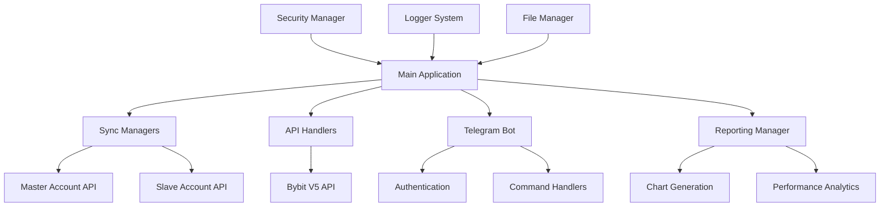

# 🚀 Copytrader v2

**Production-Ready Cryptocurrency Copy Trading Bot for Bybit**

[](https://www.python.org/downloads/)
[](https://opensource.org/licenses/MIT)
[](https://github.com/psf/black)

---

## 📋 Table of Contents

- [Features](#-features)
- [Architecture](#-architecture)
- [Installation](#-installation)
- [Configuration](#-configuration)
- [Usage](#-usage)
- [Telegram Bot](#-telegram-bot)
- [Security](#-security)
- [Monitoring](#-monitoring)
- [API Reference](#-api-reference)
- [Contributing](#-contributing)
- [License](#-license)

---

## ✨ Features

### 🔄 Core Trading Features
- **Real-time Position Synchronization** - Automatically copy positions from master to slave accounts
- **Multi-Symbol Support** - Copy trades across multiple cryptocurrency pairs
- **Flexible Copy Multipliers** - Scale position sizes with customizable multipliers
- **Advanced Risk Management** - Multi-tier stop-loss protection with automatic execution
- **Order Management** - Cancel conflicting orders and maintain clean order books

### 🛡️ Security & Reliability
- **End-to-End Encryption** - All sensitive data encrypted with Fernet encryption
- **Rate Limiting** - Built-in protection against API rate limits
- **Session Management** - Secure user sessions with automatic expiration
- **Input Validation** - Comprehensive validation of all user inputs
- **Error Recovery** - Automatic retry mechanisms with exponential backoff

### 📊 Analytics & Reporting
- **Real-time Performance Tracking** - Live balance and PnL monitoring
- **Advanced Charts** - Balance history and PnL visualization with Matplotlib
- **Performance Metrics** - Sharpe ratio, drawdown analysis, win rates
- **Daily Reports** - Automated report generation with charts
- **Portfolio Summary** - Multi-account portfolio overview

### 🤖 Telegram Integration
- **Full Bot Interface** - Complete control via Telegram commands
- **Real-time Alerts** - Instant notifications for trades and system events
- **Admin Functions** - User management and system administration
- **Permission System** - Granular permission control for different users
- **Live Status Updates** - Real-time system status and health monitoring

### 🏗️ Enterprise Architecture
- **Async/Await Design** - High-performance asynchronous architecture
- **Modular Structure** - Clean, maintainable code with separation of concerns
- **Comprehensive Logging** - Structured logging with JSON output and rotation
- **Configuration Management** - Flexible configuration with environment variables
- **Testing Framework** - Complete unit and integration test suite

---

## 🏛️ Architecture



### Core Components

1. **Main Application** (`main.py`) - Orchestrates all components with graceful shutdown
2. **Sync Logic** (`modules/sync_logic.py`) - Core copy trading engine
3. **API Handler** (`modules/api_handler.py`) - Bybit V5 API integration
4. **Telegram Bot** (`telegram_bot/`) - Complete bot interface
5. **Security Manager** (`modules/security.py`) - Encryption and authentication
6. **Reporting Manager** (`modules/reporting_manager.py`) - Analytics and charts
7. **Logger System** (`modules/logger.py`) - Structured logging

---

## 🔧 Installation

### Prerequisites

- **Python 3.8+** - Required for async features
- **pip** - Python package manager
- **Git** - For version control

### Quick Start

```bash
# Clone the repository
git clone https://github.com/your-username/copytrader-v2.git
cd copytrader-v2

# Create virtual environment
python -m venv venv
source venv/bin/activate  # Linux/Mac
# or
venv\Scripts\activate  # Windows

# Install dependencies
pip install -r requirements.txt

# Copy environment template
cp .env.example .env

# Edit configuration
nano .env  # Add your API keys and configuration
```

### Docker Installation (Optional)

```bash
# Build Docker image
docker build -t copytrader-v2 .

# Run container
docker run -d --name copytrader \
  --env-file .env \
  -v $(pwd)/data:/app/data \
  copytrader-v2
```

---

## ⚙️ Configuration

### 1. Environment Variables

Edit `.env` file with your configuration:

```bash
# Essential Configuration
COPYTRADER_ENCRYPTION_KEY=your_encryption_key_here
TELEGRAM_BOT_TOKEN=your_bot_token_here

# Bybit API Credentials
MASTER_API_KEY=your_master_api_key
MASTER_API_SECRET=your_master_api_secret
SLAVE_API_KEY=your_slave_api_key  
SLAVE_API_SECRET=your_slave_api_secret
```

### 2. Account Configuration

Create account files in `data/accounts/`:

**Master Account** (`data/accounts/master.json`):
```json
{
  "nickname": "master",
  "api_key": "your_live_api_key",
  "api_secret": "your_live_api_secret", 
  "url": "https://api.bybit.com",
  "account_type": "live",
  "role": "master",
  "telegram_id": 123456789,
  "symbols_to_copy": ["BTCUSDT", "ETHUSDT", "ADAUSDT"]
}
```

**Slave Account** (`data/accounts/slave1.json`):
```json
{
  "nickname": "slave1",
  "api_key": "your_demo_api_key",
  "api_secret": "your_demo_api_secret",
  "url": "https://api-testnet.bybit.com", 
  "account_type": "demo",
  "role": "slave",
  "telegram_id": 123456789,
  "copy_multiplier": 1.0,
  "sl_loss_tiers_usd": [100.0, 50.0, 25.0]
}
```

### 3. Telegram Bot Setup

1. Create bot with [@BotFather](https://t.me/botfather)
2. Get bot token and add to `.env`
3. Get your Telegram user ID
4. Add yourself as admin in `config/telegram_auth.json`:

```json
{
  "authorized_users": [
    {
      "user_id": 123456789,
      "username": "your_username",
      "role": "admin",
      "permissions": ["all"],
      "added_at": "2024-01-01T00:00:00Z"
    }
  ]
}
```

---

## 🚀 Usage

### Starting the Application

```bash
# Activate virtual environment
source venv/bin/activate

# Start the application
python main.py
```

### Basic Operations

The bot will automatically:
1. **Load account configurations** from `data/accounts/`
2. **Initialize API connections** to Bybit
3. **Start synchronization** between master and slave accounts
4. **Begin Telegram bot** for remote control
5. **Generate reports** and charts

### Monitoring

Check the logs for real-time status:

```bash
# View main application logs
tail -f data/logs/main.log

# View sync operation logs  
tail -f data/logs/sync.log

# View API logs
tail -f data/logs/api.log
```

---

## 🤖 Telegram Bot

### Available Commands

| Command | Description | Permission Required |
|---------|-------------|-------------------|
| `/start` | Authenticate and start session | None |
| `/help` | Show help message | None |
| `/status` | Show system status | Authorized user |
| `/balance` | Show account balances | view_balance |
| `/positions` | Show open positions | view_positions |
| `/sync_status` | Show sync status | view_sync |
| `/reports` | Generate reports with charts | view_reports |
| `/stop_loss` | Manage stop-loss settings | manage_stop_loss |
| `/admin` | Admin functions | Admin only |

### Admin Commands

```bash
# Add new user
/admin add_user 987654321 john_doe user

# Remove user  
/admin remove_user 987654321

# List all users
/admin list_users

# View system logs
/admin logs 50

# Create backup
/admin backup
```

### Real-time Notifications

The bot sends automatic notifications for:
- **Trade Executions** - When positions are copied
- **Stop-loss Triggers** - When stop-loss is activated
- **System Alerts** - API errors, connection issues
- **Daily Reports** - Automated performance summaries

---

## 🛡️ Security

### Encryption

All sensitive data is encrypted using **Fernet encryption**:
- API keys and secrets
- Authentication tokens
- Session data

### Authentication

Multi-layer security:
- **User Authorization** - Only authorized Telegram users
- **Session Management** - 24-hour session timeout
- **Rate Limiting** - Protection against abuse
- **Permission System** - Granular access control

### API Security

- **HMAC Signatures** - All API requests signed
- **Rate Limiting** - Built-in rate limit protection
- **Connection Pooling** - Secure connection management
- **Automatic Retries** - Exponential backoff on failures

### Data Protection

- **Encrypted Storage** - All sensitive data encrypted at rest
- **Secure Logging** - Sensitive data redacted from logs
- **Input Validation** - All inputs validated and sanitized
- **Error Handling** - Comprehensive error handling with context

---

## 📊 Monitoring

### Logging System

Structured JSON logging with multiple levels:

```bash
data/logs/
├── main.log          # Main application events
├── api.log           # API calls and responses  
├── sync.log          # Synchronization events
├── telegram.log      # Telegram bot activity
├── trading.log       # Trading operations
├── security.log      # Security events
├── error.log         # Error events only
└── reporting.log     # Report generation
```

### Performance Metrics

Real-time tracking of:
- **Balance Changes** - Track account balance over time
- **PnL Analysis** - Daily, weekly, monthly profit/loss
- **Drawdown Monitoring** - Maximum drawdown tracking
- **Win Rate** - Percentage of profitable trades
- **Sharpe Ratio** - Risk-adjusted returns
- **Trade Statistics** - Volume, frequency, success rate

### Health Monitoring

Automatic health checks:
- **API Connectivity** - Regular health checks to Bybit
- **Account Status** - Monitor account restrictions
- **System Resources** - Memory and CPU usage
- **Error Rates** - Track error frequency and types

---

## 🔌 API Reference

### Core Classes

#### SyncManager

```python
from modules.sync_logic import SyncManager

# Initialize sync manager
sync_manager = SyncManager(master_config, slave_config)
await sync_manager.initialize()

# Run sync cycle
await sync_manager.run_sync_cycle()

# Get status
status = sync_manager.get_sync_status()
```

#### BybitAPIHandler

```python
from modules.api_handler import BybitAPIHandler

# Initialize API handler
api = BybitAPIHandler(account_config)
await api.initialize()

# Get positions
positions = await api.get_positions()

# Place order
order = await api.place_order(
    category="linear",
    symbol="BTCUSDT", 
    side="Buy",
    order_type="Market",
    qty="0.01"
)
```

#### ReportingManager

```python
from modules.reporting_manager import ReportingManager

# Generate daily report
reporting = ReportingManager()
report = await reporting.generate_daily_report("account_name")

# Update balance history
await reporting.update_balance_history("account_name", 1000.0)
```

### Configuration API

```python
from modules.file_utils import load_account_configs, save_account_config

# Load all accounts
accounts = load_account_configs()

# Save account configuration  
save_account_config(account_config)
```

---

## 🧪 Testing

### Running Tests

```bash
# Install test dependencies
pip install pytest pytest-asyncio

# Run all tests
pytest

# Run with coverage
pytest --cov=modules --cov-report=html

# Run specific test file
pytest tests/test_api_handler.py

# Run with verbose output
pytest -v
```

### Test Structure

```
tests/
├── test_api_handler.py      # API handler tests
├── test_sync_logic.py       # Sync logic tests  
├── test_security.py         # Security tests
├── test_telegram_bot.py     # Telegram bot tests
├── test_reporting.py        # Reporting tests
└── conftest.py             # Test configuration
```

---

## 🚨 Troubleshooting

### Common Issues

**1. API Authentication Errors**
```bash
# Check API credentials in account config
cat data/accounts/master.json

# Verify API key permissions on Bybit
# Ensure "Trade" permission is enabled
```

**2. Telegram Bot Not Responding**
```bash
# Check bot token
grep TELEGRAM_BOT_TOKEN .env

# Verify bot is authorized with your user ID
cat config/telegram_auth.json
```

**3. Position Sync Issues**
```bash
# Check sync logs
tail -f data/logs/sync.log

# Verify account balance and permissions
/balance  # in Telegram bot
```

**4. Chart Generation Errors**
```bash
# Install matplotlib dependencies
pip install matplotlib numpy

# Check chart directory permissions
ls -la data/charts/
```

### Debug Mode

Enable debug logging:

```bash
# Set in .env
DEBUG_MODE=true
LOG_LEVEL=DEBUG

# Restart application
python main.py
```

### Support

For issues and support:
1. Check the [Troubleshooting](#-troubleshooting) section
2. Review logs in `data/logs/`
3. Test with demo accounts first
4. Create an issue on GitHub

---

## 📈 Performance Optimization

### Recommended Settings

**Production Environment:**
- Use SSD storage for data directory
- Minimum 2GB RAM recommended
- Stable internet connection (< 100ms latency to Bybit)
- Run on VPS for 24/7 operation

**API Rate Limits:**
- Maximum 10 requests per minute per API key
- Built-in rate limiting with exponential backoff
- Connection pooling for optimal performance

**Risk Management:**
- Start with small position sizes
- Use demo accounts for testing
- Set appropriate stop-loss levels
- Monitor maximum drawdown

---

## 🤝 Contributing

We welcome contributions! Please follow these steps:

1. **Fork the repository**
2. **Create feature branch** (`git checkout -b feature/amazing-feature`)
3. **Commit changes** (`git commit -m 'Add amazing feature'`)
4. **Push to branch** (`git push origin feature/amazing-feature`)
5. **Create Pull Request**

### Development Guidelines

- Follow **PEP 8** style guide
- Use **Black** for code formatting
- Add **type hints** for all functions
- Write **comprehensive tests**
- Update **documentation** for new features

### Code Quality

```bash
# Format code
black .

# Sort imports
isort .

# Type checking
mypy modules/

# Run linting
flake8 modules/
```

---

## 📄 License

This project is licensed under the **MIT License** - see the [LICENSE](LICENSE) file for details.

---

## ⚠️ Disclaimer

**IMPORTANT:** This software is for educational and testing purposes only. 

- **No Financial Advice** - This is not financial advice
- **Use at Your Own Risk** - Trading involves significant risk
- **Test First** - Always test with demo accounts
- **No Guarantees** - No guarantee of profits or performance
- **Compliance** - Ensure compliance with local regulations

---

## 🙏 Acknowledgments

- **Bybit** - For providing robust API
- **Python Community** - For excellent async libraries
- **Telegram** - For Bot API platform
- **Contributors** - Everyone who helped improve this project

---

**Happy Trading! 🚀📈**